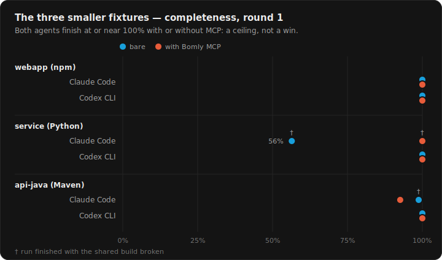
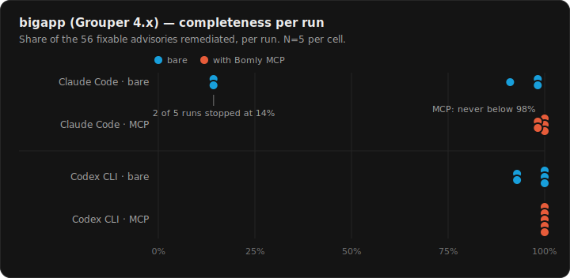
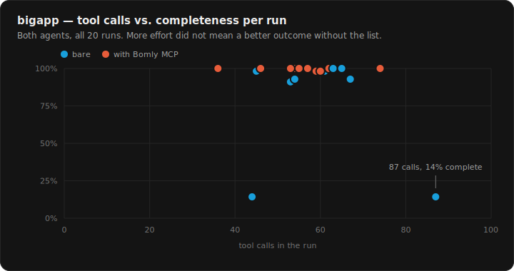
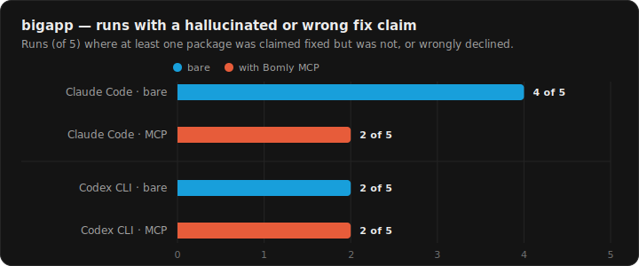
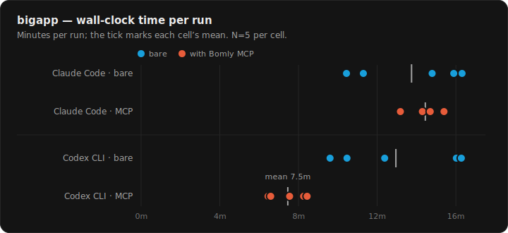

# Coding agents and vulnerable dependencies, with and without a dependency-graph MCP server

**The long-form study report.** The short version is the
[blog post](https://bomly.dev/blog/coding-agents-with-and-without-bomly-mcp);
the method details are in [METHODOLOGY.md](METHODOLOGY.md); the caveats are in
[LIMITATIONS.md](LIMITATIONS.md). Every number here is derived from
[`analysis/results.csv`](analysis/results.csv) and the per-run artifacts under
[`runs/`](runs/); every figure is generated from that CSV by
[`scripts/gen_figures.py`](scripts/gen_figures.py).

## Abstract

We asked two coding agents (Claude Code and Codex CLI) to remediate the
known-vulnerable dependencies of four applications — three real apps vendored
at old tags plus one purpose-built npm app — in two conditions: *bare* (the
agent's own tools and open network) and *mcp* (the same, plus the
[Bomly](https://bomly.dev) MCP server exposing the dependency graph,
vulnerable-package list, and fix context). Runs were isolated in Docker,
stripped of the answer key, and scored mechanically against a frozen
ground truth covering the full confirmed-vulnerable surface.

In our setup, on the three tractable fixtures both agents remediated at or
near 100% of the surface bare — a ceiling that left the MCP condition nothing
to add, which we report as a genuine null result. On the large fixture
(Internet2 Grouper 4.x: 13 Maven modules, ~300 resolved dependencies, no
native audit tool, 21 vulnerable packages / 56 fixable advisories), the
server changed outcomes: across 10 MCP-connected runs no run finished below
98% completeness, while bare runs ranged 14–100% (one agent produced two 14%
runs in five), and bare runs contained more fix claims that did not hold up.
Effects were agent-dependent: the hallucination reduction and the reliability
floor were pronounced for one agent, while the other's main measured benefit
was speed (~1.7× faster with the server). We conclude — for this setup — that
whole-graph vulnerability context over MCP matters in proportion to how hard
the *discovery* half of remediation is, and publish everything needed to
re-score or re-run the study.

## 1. Question

When a capable coding agent is told "find and fix the vulnerable
dependencies, keep the build green," what does a dependency-graph MCP server
actually change — completeness, reliability, honesty of the self-reported
fixes, or speed? And in which project regimes?

## 2. Method (summary)

See [METHODOLOGY.md](METHODOLOGY.md) for the full protocol, isolation design,
scoring rules, and the honest list of deviations from the preregistered
design. In brief:

- **Agents:** Claude Code 2.1.201 (`claude-sonnet-5` on the three smaller
  fixtures, `claude-opus-4-8` on bigapp; effort high) and Codex CLI 0.142.5
  (`gpt-5.5`, effort medium). Versions, models, timestamps, tokens, and tool
  counts recorded per run in `meta.json`.
- **Conditions:** identical prompt and instructions except one equal-length
  tool-disclosure line; the *mcp* condition has `bomly mcp serve` connected.
- **Fixtures:** `webapp` (npm, purpose-built), `service` (CTFd 3.7.7),
  `api-java` (Dependency-Track 4.10.0), `bigapp` (Grouper 4.x). Real,
  published advisories only — nothing injected.
- **Scoring:** completeness over the frozen full vulnerable surface
  (dual-confirmed by an independent scanner everywhere except bigapp, which
  is bomly-only — see [LIMITATIONS.md](LIMITATIONS.md) #2); per-package
  outcome labels including `HALLUCINATED` (self-report claims fixed, advisory
  still applies); runs executed 2026-07-10/11, N=5 per cell, human-gated.

## 3. Results

### 3.1 The three tractable fixtures: a ceiling, honestly

Round 1 of the planned N=5 (both agents, both conditions, all three
fixtures):

| fixture | claude/bare | claude/mcp | codex/bare | codex/mcp |
|---|---|---|---|---|
| webapp | 100% | 100% | 100% | 100% |
| service | 56% † | 100% † | 100% | 100% |
| api-java | 99% † | 93% | 100% | 100% |

† = the run finished with the shared build broken.



One agent's bare condition finished 100% complete, build green, on all three
fixtures. With no completeness headroom, additional rounds could only
re-confirm the ceiling, so the remaining rounds on these fixtures were
dropped (deviation #4 in [METHODOLOGY.md](METHODOLOGY.md)) and the budget
went to the large-project fixture instead.

What variance exists here is not an MCP signal: Claude Code's sub-100 cells
came from *over-scoping* — chasing the full surface, breaking the shared
build on a side attempt, or spending its budget before finishing — a
per-agent behavior we report as a finding rather than engineering around.
(The earlier v2 pilot, on sonnet for both hard fixtures, showed the same
split more sharply; those numbers are in
[METHODOLOGY.md](METHODOLOGY.md) and `analysis/results-pilot.csv`.)

Two qualitative notes from these fixtures:

- **Correct declines improved with the server.** api-java contains one
  genuine no-fix package. With MCP, codex correctly left it alone and said
  why; bare, it was silently skipped. The service fixture's one
  fix-incompatible case (`cryptography`, where every advisory-clearing
  version conflicts with a sibling pin) was correctly reasoned to its real
  ceiling by both conditions.
- **MCP was not free here.** Both agents were slower with the server on
  webapp (e.g. 173s → 290s and 118s → 227s in round 1). Where discovery is
  trivial, the extra calls are overhead.

### 3.2 bigapp: the large-project regime

Grouper 4.x: 13-module Maven reactor, ~300 resolved dependencies, no native
audit command; 21 confirmed-vulnerable packages carrying 56 fixable
advisories. Claude Code on `claude-opus-4-8`; N=5 per cell.

**Completeness per run** (% of 56 fixable advisories resolved):

| cell | r1 | r2 | r3 | r4 | r5 | mean | min |
|---|---|---|---|---|---|---|---|
| claude / bare | 91.1 | 14.3 | 98.2 | 98.2 | 14.3 | 63.2 | 14.3 |
| claude / mcp | 100 | 100 | 98.2 | 100 | 98.2 | 99.3 | 98.2 |
| codex / bare | 92.9 | 92.9 | 100 | 100 | 100 | 97.1 | 92.9 |
| codex / mcp | 100 | 100 | 100 | 100 | 100 | 100 | 100 |



**Reliability is the headline.** No MCP-connected run, from either agent,
finished below 98%. Bare runs spread: codex 93–100%, claude 14–98%. The two
14% runs are worth dwelling on: in run 2, claude/bare made **87 tool calls —
the most of any run in the cell — and resolved 8 of 56 advisories.** The
budget went into enumerating a 13-module tree by hand — reading poms,
grepping the tree, running Maven dependency and versions plugins, searching
advisories — not into fixing. Given the
list up front, the same agent, same prompt, finished ≥98% five times out of
five.



Tool-call effort does not predict outcome in the bare condition (the 87-call
run finished at 14%; a 44-call run did too); with the server, every level of
effort landed ≥98%. We did not chart token usage: the two CLIs meter tokens
differently (one excludes cache reads the other counts), so a cross-agent
token chart would mislead — the raw per-run numbers are in
`analysis/results.csv` and each run's `meta.json`.

**Fix-claim honesty.** A `HALLUCINATED` label means the run's own `FIXES.md`
claims a package was fixed but the advisory still applies to the rebuilt
workspace; `INCORRECTLY_DECLINED` means a fixable package was declared
unfixable. Counting runs that contain at least one such package:

| cell | runs affected (of 5) | package-level count across 5 runs |
|---|---|---|
| claude / bare | 4 | 9 |
| claude / mcp | 2 | 4 |
| codex / bare | 2 | 6 (2 hallucinated + 4 wrongly declined) |
| codex / mcp | 2 | 5 |



The same few packages account for nearly all of it: `commons-httpclient`,
`org.apache.axis2:axis2-transport-http`, the BouncyCastle pair
(`bcprov`/`bcpkix`), `software.amazon.ion:ion-java`, and occasionally
`commons-lang` and `hibernate-core` — exactly the awkward cases (relocated
artifacts, partial fixes, old coordinates) where confident pattern-matching
substitutes for verification. For claude the server halved both the
run-level and package-level counts. For codex it did not move the run-level
number at all (2 of 5 both ways — including one MCP run with a four-package
cluster of wrong claims), which we report as-is: the server reduced wrong
claims for one agent and left them roughly unchanged for the other.

**Speed.**

| cell | wall-clock per run (s) | mean |
|---|---|---|
| claude / bare | 979 · 626 · 953 · 887 · 678 | 825s |
| claude / mcp | 924 · 880 · 858 · 882 · 791 | 867s |
| codex / bare | 961 · 977 · 743 · 576 · 628 | 777s |
| codex / mcp | 387 · 495 · 453 · 395 · 506 | 447s |



Codex converted the saved discovery work into wall-clock time (~1.7× faster
with the server, and its slowest MCP run beat its fastest bare run). Claude
spent about the same time either way, converting the savings into more
remediation instead. MCP tool usage was real in every MCP run (4–9 calls per
claude run, 7–23 per codex run), so the mcp condition is not "the server sat
idle."

## 4. Discussion

1. **On tractable projects, capable agents don't need a dependency-graph
   tool for known-CVE remediation.** They saturate the task bare. We say
   this plainly because pretending otherwise would be noticed — and because
   it locates the value honestly.
2. **The value appears where discovery is the bottleneck, and it is a floor,
   not a mean.** On the large fixture the server's effect was to eliminate
   the catastrophic run: nothing below 98% in 10 MCP runs, versus a bare
   spread reaching 14%. If you run agents unattended, tail behavior is the
   number that matters.
3. **Wrong claims are worse than misses, and the server reduced them for the
   agent that made them most.** A report that says "fixed" when the advisory
   still applies survives review precisely because it looks done.
4. **The effect is agent-dependent, and we decline to rank the agents.**
   Different models, different settings; one agent's benefit was mostly
   reliability and honesty, the other's mostly speed. The supported
   comparison is within-agent, bare vs MCP.
5. **The regime boundary is haystack size, not vulnerability count.** 21
   vulnerable packages is not many; ~300 dependencies across 13 modules with
   no audit command is what broke the bare condition's consistency. A
   corollary we learned the slow way: genuinely large, maintained,
   *vulnerable* open-source Maven surfaces are rare — an earlier candidate
   count of ~107 vulnerable packages for this fixture melted to 21 real ones
   once CPE-matching noise was removed.

## 5. Threats to validity

The numbered list in [LIMITATIONS.md](LIMITATIONS.md) is the canonical set:
small N and a single large-project fixture; bomly-only scoring on bigapp;
the cross-fixture Claude model change; per-run variance that means should
not summarize; the post-prereg addition of bigapp; the symmetric round-1
workspace leak; self-report-dependent hallucination labels; training-data
familiarity of the smaller fixtures' CVEs; and MCP overhead on small
projects. None are hidden in this report's numbers, and the raw transcripts
allow re-checking every label.

## 6. What the study did to Bomly itself

Running the tool underneath real agents surfaced four real bugs, all fixed
and released during the study window:

| Issue | What it was | Fixed in |
|---|---|---|
| [bomly-cli#237](https://github.com/bomly-dev/bomly-cli/issues/237) | system pip-audit polluted Python interpreter detection | 0.16.1 |
| [bomly-cli#243](https://github.com/bomly-dev/bomly-cli/issues/243) | ANSI codes in `mvn dependency:tree` output hid every transitive Maven dep | 0.16.2 |
| [bomly-cli#245](https://github.com/bomly-dev/bomly-cli/issues/245) | oversized MCP responses truncated scan calls | 0.17.0 |
| [bomly-cli#252](https://github.com/bomly-dev/bomly-cli/pull/252) | Maven detector failed on every multi-module reactor | 0.17.1 |

The last one is load-bearing: the bigapp result exists only because the study
forced that fix. The harness found roughly as many bugs in the harness (see
the pilot arcs in [METHODOLOGY.md](METHODOLOGY.md) and
[`analysis/findings-pilot-v1.md`](analysis/findings-pilot-v1.md)) — which is
the strongest argument we know for publishing scoring code along with
results.

## 7. Reproduction

Re-score any published run (Docker, no credentials):

```bash
make verify-only RUN=runs/claude/mcp/bigapp/1
```

Run a live cell end to end (needs a Claude Code or Codex credential — see
[CREDENTIALS.md](CREDENTIALS.md)):

```bash
make reproduce-one AGENT=codex CONDITION=mcp SCOPE=webapp RUN_NUMBER=1
```

Rebuild the roll-up CSV and the figures:

```bash
make aggregate
python3 scripts/gen_figures.py
```

## Appendix: where every number lives

- `runs/<agent>/<condition>/<fixture>/<n>/` — `meta.json` (versions, model,
  effort, timing, tokens, tool/MCP call counts), `result.json` (per-package
  outcomes + completeness), `diff.patch`, `FIXES.md` (the agent's
  self-report), full raw and normalized transcripts.
- `analysis/results.csv` — flat roll-up used for every table and figure
  above.
- `fixtures/ground-truth.json`, `fixtures/GROUND_TRUTH.md`,
  `fixtures/SLOTS.yaml` — the frozen answer key and the hand-verified
  overlay.
- `scoring/` — rubric and manual adjudication log.
- `runs-pilot/`, `runs-pilot-v1/` — the two pilot generations, kept as-is.
